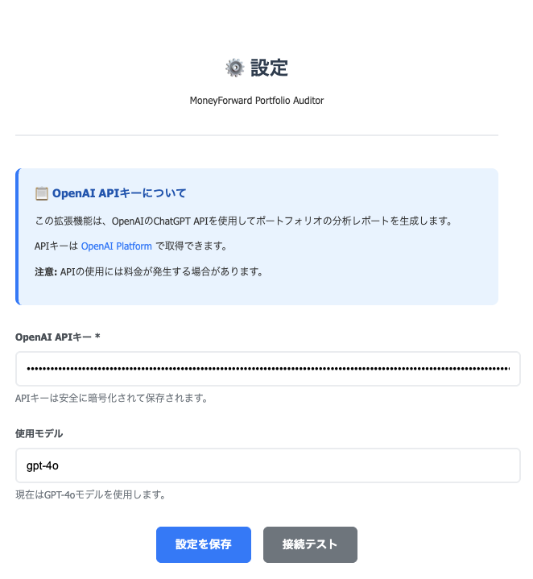

# MoneyForward Portfolio Auditor

A Chrome extension that automatically extracts and analyzes portfolio data from MoneyForward using ChatGPT API to provide comprehensive investment insights.

## Features

- **Automatic Data Extraction**: Extract portfolio data (stocks and mutual funds) from MoneyForward portfolio pages
- **AI-Powered Analysis**: Generate detailed investment analysis reports using ChatGPT API
- **Multiple Investment Perspectives**: Get insights from 3 different investment stances:
  - **Conservative (慎重派)**: Risk-averse, loss prevention focused
  - **Balanced (バランス派)**: Balanced approach between profit and stability  
  - **Aggressive (攻め派)**: High-risk, high-return focused
- **Data Export**: Export portfolio data to CSV and JSON formats
- **Secure Configuration**: Safe API key management through extension options

## Screenshots

### Extension Management


### Configuration Settings

*Configure your OpenAI API key and model settings*

### Main Interface

*Extract data, generate reports, and export data with one click*

### Analysis Report

*Comprehensive portfolio analysis with multiple investment perspectives*

## Installation

1. Clone this repository:
   ```bash
   git clone https://github.com/your-username/mfaudit.git
   ```

2. Open Chrome and navigate to `chrome://extensions/`

3. Enable "Developer mode" (toggle in top right)

4. Click "Load unpacked" and select the cloned repository folder

5. The extension will appear in your Chrome toolbar

## Configuration

1. Click the extension icon and go to "Settings" (設定)
2. Enter your OpenAI API key
3. Select the desired ChatGPT model (default: gpt-4o)
4. Save your settings

## Usage

1. **Navigate to MoneyForward**: Go to `https://moneyforward.com/bs/portfolio`
2. **Extract Data**: Click the extension icon and select "データを抽出" (Extract Data)
3. **Generate Analysis**: Click "分析レポート生成" (Generate Analysis Report) for AI-powered insights
4. **Export Data**: Use "CSVエクスポート" or "JSONエクスポート" to download your data

## Data Extraction

The extension extracts the following data from MoneyForward:

### Stocks (株式 - 現物)
- Stock code and name
- Quantity held
- Average acquisition price
- Current price
- Market value
- Daily change
- Profit/Loss (amount and percentage)
- Holding institution

### Mutual Funds (投資信託)
- Fund name
- Quantity held
- Average acquisition price
- Base price
- Market value
- Daily change
- Profit/Loss (amount and percentage)
- Holding institution

## Analysis Report Features

The AI analysis provides:
- **Individual Stock/Fund Evaluation**: Detailed assessment of each holding
- **Portfolio Balance Review**: Overall asset allocation analysis
- **Investment Recommendations**: Buy/Hold/Sell suggestions for each position
- **Risk Assessment**: Risk evaluation based on current market conditions
- **Rebalancing Suggestions**: Portfolio optimization recommendations

## Requirements

- Chrome browser (version 88 or higher)
- MoneyForward account with portfolio data
- OpenAI API key for report generation
- Active internet connection

## Privacy & Security

- API keys are stored locally in Chrome's secure storage
- No portfolio data is stored or transmitted except to OpenAI for analysis
- All communications use HTTPS encryption
- Extension only accesses MoneyForward portfolio pages when explicitly activated

## Technical Specifications

- **Manifest Version**: 3
- **Permissions**: Active tab, storage
- **Host Permissions**: moneyforward.com
- **Content Security Policy**: Restricts external script execution for security

## Support

For issues or feature requests, please open an issue on GitHub.

## License

This project is licensed under the MIT License - see the LICENSE file for details.